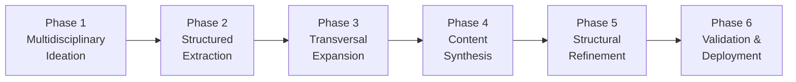

# 6-Phase Prompt Development Framework

> Transform prompt engineering from intuitive art to systematic science with our proven methodology.

## 🎯 Framework Overview

The 6-Phase Framework is a systematic approach to developing professional-grade prompts from initial concept to production deployment. Unlike traditional trial-and-error methods, this methodology ensures consistent, high-quality results through structured iteration and cross-domain validation.

### Why This Framework Works
- **Reproducible Results**: Systematic process eliminates guesswork
- **Cross-Domain Innovation**: Multidisciplinary approach sparks creativity
- **Quality Assurance**: Built-in validation and refinement stages
- **Team Scalability**: Standardized process enables collaboration
- **Production Ready**: End-to-end methodology from concept to deployment

## 📈 Framework Phases



---

## 🧠 Phase 1: Multidisciplinary Ideation

### Purpose
Generate conceptual foundations through systematic cross-domain thinking.

### Process
1. **Start with Creative Void**: Begin with impulse, question, or intuition
2. **Create 3-Sphere Intersection**: Select three disciplinary domains (e.g., AI + Psychology + Business)
3. **Generate Tension**: Look for friction points between concepts
4. **Initial Brainstorming**: Use LLM to explore combinations, gaps, and paradoxes

### Key Principles
- **Tension Creates Innovation**: Friction between concepts sparks creativity
- **No Immediate Solutions**: Focus on semantic fractures and potential
- **Document Everything**: Capture raw brainstorming for later reference

### Example Application
**Scenario**: Customer service automation
- **Sphere 1**: Artificial Intelligence (capabilities, limitations)
- **Sphere 2**: Psychology (empathy, communication patterns)
- **Sphere 3**: Business Operations (efficiency, cost optimization)
- **Tensions**: How to maintain human empathy while maximizing efficiency?

### Deliverable
**Brainstorming_v1 Document**:
- Raw conceptual explorations
- Identified tensions and opportunities
- Preliminary use cases and scenarios
- Questions for further investigation

---

## 📋 Phase 2: Structured Extraction

### Purpose
Transform raw ideas into actionable components with clear organization.

### Process
1. **Extract Key Elements**: Identify phrases, tasks, analogies, and cues
2. **Create Bullet Points**: Reduce concepts to X-ray clarity
3. **Archive Systematically**: Choose appropriate container (Notion, docs, etc.)
4. **Maintain Traceability**: Tag by domain, date, and evolution stage

### Key Principles
- **Clarity Over Completeness**: Better to capture essence than everything
- **Structured Storage**: Organized for easy retrieval and evolution
- **Version Control**: Track development stages for learning

### Example Application
From Phase 1 customer service brainstorming:
- **Core Tasks**: Response generation, emotion detection, escalation logic
- **Key Constraints**: Response time, tone consistency, knowledge boundaries
- **Success Metrics**: Customer satisfaction, resolution rate, efficiency gains
- **Integration Points**: CRM systems, knowledge bases, human handoff

### Deliverable
**Brainstorming_v1 Structured File**:
- Organized bullet points by category
- Clear task definitions
- Preliminary constraints and requirements
- Traceable version information

---

## 🔄 Phase 3: Transversal Expansion

### Purpose
Stress-test and strengthen concepts through lateral thinking and new perspectives.

### Process
1. **Introduce New Domains**: Add 2 additional disciplinary spheres
2. **Force Perspective Shifts**: Reinterpret v1 concepts through new lenses
3. **Lateral Exploration**: Push ideas out of comfort zone
4. **Document Evolution**: Create Brainstorming_v2 with enhanced scope

### Key Principles
- **Discomfort Breeds Innovation**: Push beyond obvious solutions
- **Multiple Perspectives**: Each domain reveals different facets
- **Controlled Expansion**: Systematic rather than chaotic exploration

### Example Application
Adding to customer service scenario:
- **Sphere 4**: Education (learning theory, knowledge transfer)
- **Sphere 5**: Performance Arts (timing, presence, audience engagement)
- **New Insights**: How can service interactions become learning opportunities?
- **Enhanced Approaches**: Adaptive communication styles, performance metrics

### Deliverable
**Brainstorming_v2 Enhanced Document**:
- Expanded conceptual framework
- New use cases and applications
- Enhanced constraints and requirements
- Cross-domain insights and connections

---

## ⚗️ Phase 4: Content Synthesis

### Purpose
Merge insights from multiple exploration phases into coherent, focused framework.

### Process
1. **Pattern Recognition**: Identify common themes across v1 and v2
2. **Eliminate Redundancies**: Remove duplicate or conflicting elements
3. **Synthesize Core Logic**: Create unified approach from diverse inputs
4. **Establish Architecture**: Define prompt structure and flow

### Key Principles
- **Unity from Diversity**: Merge different perspectives into single vision
- **Essential vs Nice-to-Have**: Focus on core functionality
- **Logical Consistency**: Ensure all elements work together

### Example Application
Synthesizing customer service insights:
- **Core Function**: Intelligent response generation with empathy
- **Key Components**: Context analysis, tone adaptation, solution mapping
- **Integration Logic**: Input → Analysis → Response → Feedback loop
- **Success Criteria**: Speed + accuracy + customer satisfaction

### Deliverable
**Unified Prompt Architecture**:
- Core prompt structure defined
- Key components and their relationships
- Integration logic and flow
- Success metrics and validation criteria

---

## 🎯 Phase 5: Structural Refinement

### Purpose
Transform unified concept into production-ready prompt with optimized structure.

### Process
1. **Define Role Precisely**: Clear LLM persona and expertise
2. **Specify Task Details**: Unambiguous instructions and expectations
3. **Format Output Structure**: Exact format requirements and constraints
4. **Optimize for Target LLM**: Adjust complexity and style for specific model

### Key Principles
- **Precision Over Elegance**: Clarity trumps sophistication
- **Test-Driven Development**: Build with validation in mind
- **Model-Specific Optimization**: Account for LLM strengths and limitations

### Example Application
Customer service prompt refinement:
```markdown
**Role**: Act as an expert customer service representative with 10+ years experience in technical support and conflict resolution.

**Task**: Analyze customer inquiry and generate appropriate response that addresses the core issue while maintaining empathetic, professional tone.

**Input Structure**: 
- Customer message (required)
- Customer history (optional)
- Product context (required)

**Output Format**:
{
  "response": "Customer-facing message",
  "tone": "empathetic|professional|urgent",
  "escalation_flag": true/false,
  "suggested_actions": ["action1", "action2"],
  "confidence_score": 0.0-1.0
}

**Constraints**:
- Maximum 200 words for response
- Always acknowledge customer emotion
- Provide specific next steps
- Flag for escalation if uncertainty > 30%
```

### Deliverable
**Production-Ready Prompt**:
- Optimized structure and formatting
- Clear role and task definitions
- Precise output specifications
- Model-specific optimizations

---

## ✅ Phase 6: Validation & Deployment

### Purpose
Test prompt performance and establish maintenance protocols for production use.

### Process
1. **Multi-Scenario Testing**: Validate across different use cases and edge cases
2. **Performance Metrics**: Measure consistency, accuracy, and efficiency
3. **Documentation Creation**: Build usage guides and troubleshooting resources
4. **Deployment Protocols**: Establish monitoring and maintenance procedures

### Key Principles
- **Evidence-Based Validation**: Measure don't assume
- **Edge Case Preparedness**: Test boundary conditions
- **Sustainable Operations**: Build for long-term maintenance

### Example Application
Customer service prompt validation:
- **Test Scenarios**: 50 real customer inquiries across product categories
- **Metrics**: Response accuracy (90%), tone appropriateness (95%), escalation precision (85%)
- **Edge Cases**: Angry customers, technical issues, billing disputes
- **Monitoring**: Daily accuracy checks, weekly performance reviews

### Deliverable
**Deployed Prompt System**:
- Validated performance metrics
- Complete documentation package
- Monitoring and maintenance protocols
- Version control and update procedures

---

## 🎛️ Advanced Implementation

### Framework Customization

#### For Different Industries
- **Technology**: Emphasize technical accuracy and innovation potential
- **Healthcare**: Focus on safety, compliance, and precision
- **Finance**: Prioritize risk assessment and regulatory alignment
- **Creative**: Balance structure with creative flexibility

#### For Team Environments
- **Collaborative Development**: Multiple team members across phases
- **Parallel Processing**: Multiple prompt versions developed simultaneously
- **Quality Gates**: Formal reviews between phases
- **Shared Resources**: Common templates and evaluation criteria

### Integration with Tools

#### Documentation Platforms
- **Notion**: Ideal for collaborative phase tracking and template libraries
- **Confluence**: Enterprise documentation and knowledge sharing
- **GitHub**: Version control and collaborative development

#### Testing Environments
- **Multiple LLM Testing**: Validate across GPT, Claude, Mistral, etc.
- **A/B Testing Frameworks**: Compare prompt variations systematically
- **Performance Monitoring**: Track metrics over time

## 📊 Success Metrics

### Development Efficiency
- **Time to Production**: Average development cycle duration
- **Iteration Reduction**: Fewer refinement cycles needed
- **Quality Consistency**: Reduced variation in prompt performance

### Output Quality
- **Task Completion Rate**: Percentage of successful prompt executions
- **Output Consistency**: Similarity of results across multiple runs
- **User Satisfaction**: Feedback from prompt users and consumers

### Business Impact
- **Process Efficiency**: Time savings vs manual alternatives
- **Cost Reduction**: Resource optimization through automation
- **Quality Improvement**: Enhanced output quality vs previous methods

## 🔒 Professional Package Extensions

**This framework represents the foundation. Professional Package includes:**

### Advanced Methodologies
- **Multi-Agent Orchestration**: Coordinating multiple specialized prompts
- **Dynamic Adaptation**: Self-modifying prompts based on performance
- **Cross-Cultural Optimization**: Adapting prompts for global audiences

### Enterprise Features
- **Team Collaboration Protocols**: Standardized development processes
- **Quality Assurance Frameworks**: Systematic validation and testing
- **Integration Blueprints**: Connection with enterprise systems

### Specialized Applications
- **Industry-Specific Templates**: Pre-built frameworks for common sectors
- **Compliance Frameworks**: Meeting regulatory and security requirements
- **Performance Analytics**: Advanced metrics and optimization tools

**Get Professional Package**: [Contact for Enterprise Features](mailto:your-email@domain.com)

## 🛠️ Implementation Tools

### Phase Tracking Templates
- **Phase Checklists**: Ensure completion of each stage
- **Decision Trees**: Guide choices at critical junctions
- **Quality Gates**: Validation criteria between phases

### Collaboration Frameworks
- **Role Definitions**: Clear responsibilities for team development
- **Review Protocols**: Structured feedback and improvement processes
- **Knowledge Sharing**: Best practices and lessons learned

## 📚 Related Resources

- [Quick Start Guide](../quick-start.md) - Immediate implementation
- [Template Library](../../templates/basic/README.md) - Ready-to-use examples
- [Case Studies](../case-studies/README.md) - Real-world applications
- [Professional Package](mailto:your-email@domain.com) - Advanced features

---

🎯 **Ready to implement systematic prompt development?**

Start with [Phase 1](../../templates/basic/README.md) using our basic templates, or [contact us](mailto:your-email@domain.com) for professional implementation support.

**Transform your prompt engineering from art to science.** 🚀
